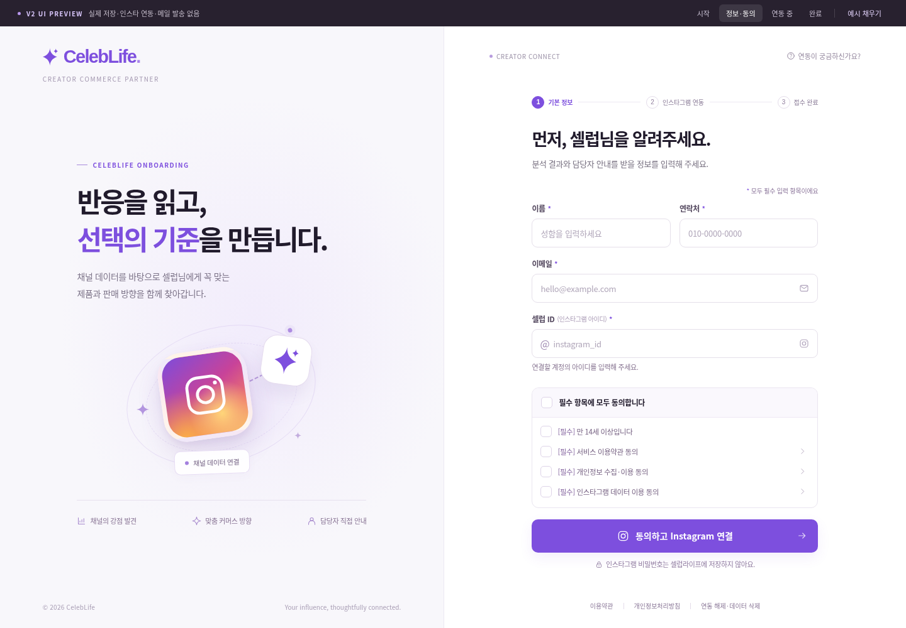
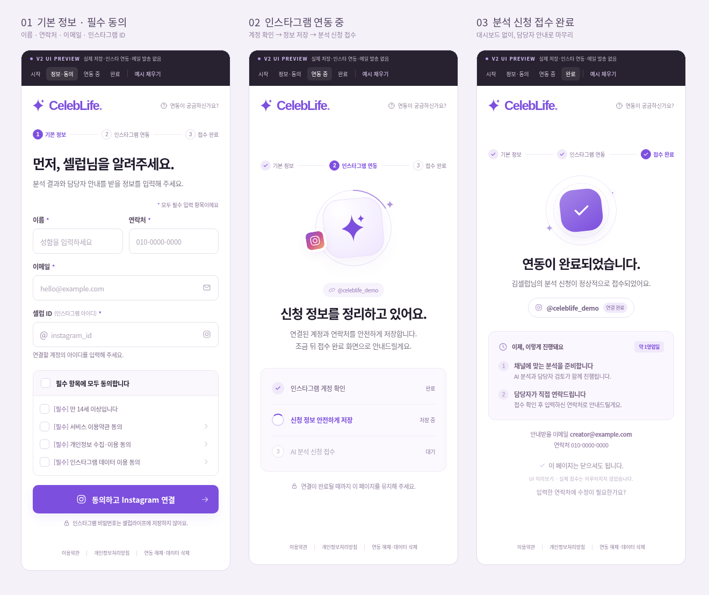

# UI/UX 구현 명세 — 승인 시안 유지

버전 1.3.2 AUDIT · 2026-09-10 · 대상: 프런트엔드 구현자 / QA / 담당자

## 1. 디자인 기준과 우선순위

`reference/approved/index.html`과 `ui/styles.css`를 직접 이식한다. 화면 이미지를 보고 비슷하게 새로 디자인하지 않는다. 정식 기능·동의·접수 정책은 `V2_SPEC.md`, API는 `contracts/onboarding.ts`가 기준이다. 이 문서는 화면별 동작과 실제 연동 시 필요한 차이를 정의한다.

승인 원본과 분리 UI는 **데모**다. 모의 인증창과 시간 기반 성공을 실제 제품으로 옮기지 않는다. 원본 파일을 수정하지 않고 Next.js 앱에서 실제 기능으로 교체한다. 이하 신규 오류/재연동 문구는 승인 레이아웃을 사용하는 구현 명세이며, 이미 디자인된 추가 PNG가 있다고 가정하지 않는다.

### 승인 화면

전체 승인 PNG는 `reference/approved/screenshots/`. 임시 로고는 승인 원형 유지가 기본이며 실제 회사 로고 교체는 별도 시각 비교를 거친다. 폰트 파일은 이 패키지에 포함하지 않는다.

## 2. 시각 토큰과 레이아웃

| 항목 | 원본 기준 | 구현 조건 |
|---|---|---|
| 주색 | `#7d4fde` | CTA/강조/단계 활성색 |
| 진한 주색 | `#6e3ed2` | hover |
| 연한 배경 | `#f8f5ff`, 브랜드 패널 `#f8f7fb` | 원본 그라디언트·그림자 유지 |
| 본문 | `#211b2c` | 가독성 우선 |
| 보조·선 | `#797282`, `#eae5f0` | 후반 legibility override까지 포함 |
| 글꼴 | Pretendard 우선, Noto/Malgun Gothic/system fallback | 웹폰트 추가 시 네트워크·라이선스·레이아웃 재검증 |
| 데스크톱 | 좌 브랜드 패널 / 우 폼 | `minmax(440px,1fr) minmax(540px,1.04fr)` 기준 |
| 1080px 이하 | 좌우 폭·간격 축소 | 원본 media query 유지 |
| 860px 이하 | 브랜드 패널 숨김 / 한 열 / 상단 로고 | 모바일 전용 폼 틀 |
| 420px 이하 | 좌우 22px 내외 여백 | 실제 CSS 우선 |
| 345px 이하 | 이름·전화번호도 1열 | 320px 가로 넘침 금지 |
| 폼 폭 | 기본 max 455px, 넓은 화면 490px | 임의 카드 폭 확장 금지 |
| 입력 | 46~49px 높이, 9px radius | 모바일 실제 입력 font-size 16px |
| CTA | 53px 높이, 10px radius | 로딩 중 동일 폭 유지 |

원본 CSS에는 뒤쪽 보정 규칙이 있다. 앞쪽 선언만 가져오지 않는다. 원본 preview toolbar 42px/67px는 제품에서 제거한다. 그만큼 콘텐츠가 전체 viewport를 쓰는 것은 승인된 이식 차이이며, 위쪽에 빈 띠를 남기지 않는다. `min-height:100svh`와 모바일 safe-area를 고려하고 내용이 길어지면 세로 스크롤을 허용한다.

이식 후 WCAG AA 수준의 텍스트 대비·키보드 접근을 검사한다. 대비가 부족한 보조 문구는 같은 보라/회색 계열 안에서 최소 보정하고 변경 전후와 이유를 기록한다. '원본 보존'을 접근성 결함 유지의 이유로 쓰지 않는다. 색상 변경을 포함한 시각 차이를 테스트 보고서에서 숨기지 않는다.

## 3. 화면 지도

| ID | 경로/구간 | 서버 전제 | 종료/다음 행동 |
|---|---|---|---|
| UX-01 시작 | `/` | 개인정보 조회 불필요 | 연결 시작 → `/apply` |
| UX-02 정보·동의 | `/apply` | bootstrap, 활성 정책 | 검증 성공 → 실제 Instagram 이동 |
| EXT-01 외부 인증 | Instagram | Meta가 제공하는 로그인/추가 인증/권한 UI | 승인 → 우리 callback, 취소 → 오류 |
| UX-03 처리 중 | `/connecting` | 정상 callback, 현재 attempt | complete 요청 및 status 확인 |
| UX-04 계정 불일치 | 기존 모달 | 서버 candidate+revision | 실제 계정 승인 / 다시 연결 |
| UX-05 최초 완료 | `/complete` | DB 완료, new, analysisRequested=true | 접수 안내 후 종료 |
| UX-06 재연동 완료 | 같은 `/complete` | DB 완료, reconnection | 갱신 안내 후 종료 |
| UX-07 실패/취소 | `/connection-error` | 안전한 오류 코드 | 상태 재확인/재연결/폼 복귀 |
| UX-08 약관·안내 | 모달 및 `/policies/*` | 확정 문서 콘텐츠 | 닫기, 원래 위치·포커스 복귀 |
| UX-09 전환기 완료 | 같은 틀의 legacy 변형 | 유효 v1 callback만 | 연결 사실만 안내, 가짜 연락처 금지 |

## 4. UX-01 시작 화면

좌측 '반응을 읽고, 선택의 기준을 만듭니다.' 카피, Instagram 타일, 심벌, 장식, 혜택 3개를 유지한다. 우측 제목은 '셀럽님의 다음 기회, 연결에서 시작됩니다.'다. CTA '인스타그램 연결 시작하기'는 우리 폼으로 간다. 아직 Instagram으로 바로 이동하지 않는다.

'연동이 궁금하신가요?'는 안내 모달. Instagram 비밀번호/2FA 코드를 우리가 받지 않는다고 설명한다. Meta 승인·인증을 받았다는 별도 보증마크로 문구를 확대하지 않는다.

## 5. UX-02 정보·동의 폼

제목: **먼저, 셀럽님을 알려주세요.**
설명: **분석 결과와 담당자 안내를 받을 정보를 입력해 주세요.**

| 필드 | name / ID | 제품 검증 규칙 | 표시/보안 |
|---|---|---|---|
| 이름 | fullName / full-name | trim 후 1~50자, 제어문자 금지 | 한 글자 이름 허용; 이름 진위 인증 아님 |
| 연락처 | phone / phone | 한국 번호 형식, 0 뒤 1~9로 시작; 정규화 후 `+82[1-9][0-9]{7,9}` | type=tel, inputmode=tel, 문자 인증 없음 |
| 이메일 | email / email | trim, 최대 254자, 이메일 기본 형식·제어문자 검사 | inputmode=email, 소유권 인증 없음 |
| 셀럽 ID | instagramUsername / instagram | @ 제거·영문 소문자, 영문/숫자/_ 시작, 이후 . 허용, 최대30자 | 인스타 계정명 참고값; 소유권 판단 금지 |

국내 연락처 형식 지원은 현재 참고 코드의 구현 기본값이다. '+'를 숫자가 아니라며 지우거나 국제형 한국 번호를 무조건 010 포맷으로 바꾸지 않는다. 휴대전화와 지역번호는 각각 표시하고, 사용자 입력을 의미 없이 재작성하지 않는다. 해외 번호 지원은 별도 범위 변경이다.

**프런트와 서버는 같은 검증 모듈/테스트를 사용한다.** 원본 demo의 2글자 제한, 무조건 숫자만 추출하는 전화번호 처리, 임의 이메일 fallback은 실제 앱에서 교체한다. 이름 1자 허용은 v1.1 서버 기준을 그대로 따르는 동작 정합성 수정이다. 개인정보는 입력 중 서버 전송·자동 저장·analytics 기록하지 않는다. 동의 후 제출한 유효 draft만 제한 시간 동안 복원한다.

동의 4개는 만14세 이상, 서비스 약관, 개인정보 수집·이용, Instagram 데이터 이용이다. 모두 기본 해제. 전체 동의는 자식 checkbox와 indeterminate를 동기화한다. 약관 '보기' 클릭이 자동 동의로 이어지지 않는다. 수집·이용 동의와 footer 개인정보처리방침은 다른 문서로 연결한다.

CTA: **동의하고 Instagram 연결**. 폼이 빈 상태에서도 누르면 오류를 안내한다. 네트워크 제출 중에만 disabled 처리하고 '연결 화면으로 이동 중…'으로 바꾼다. 서버 오류가 나면 입력값과 선택을 유지하되 변경된 약관이면 해당 항목은 다시 확인시킨다.

CTA 아래 유지 문구: '인스타그램 비밀번호는 셀럽라이프에 저장하지 않아요.'
추가 문구: **다음 단계에서 Instagram 로그인 및 권한 승인이 진행됩니다. 완료 후 셀럽라이프로 돌아옵니다.**

입력 오류는 필드 아래에 표시하고 첫 오류로 포커스를 이동한다. 서버 requestKey/policy 오류는 인풋 내부 ID를 노출하지 않고 폼 상단의 안전한 안내로 표시한다. 필드 오류와 제출 오류를 구분한다.

## 6. EXT-01 Instagram 화면

같은 탭 `window.location.assign(authorizeUrl)`으로 이동한다. 팝업/iframe 로그인, 외부 페이지 scraping, 우리 사이트 안의 Instagram 비밀번호 화면은 만들지 않는다. 이미 로그인돼 있으면 제공자 판단으로 일부 화면이 생략될 수 있으므로 비밀번호 입력부터 반드시 강제하지 않는다.[S6]

인앱 브라우저에서 외부 브라우저로 넘어가 바인딩 cookie가 없어졌다면 자동 연결 성공으로 처리하지 않는다. '처음 연결을 시작한 브라우저에서 다시 진행해 주세요'를 안내한다. 비밀 cookie나 code를 복사하도록 시키지 않는다. Android/iOS 실제 기기 검증은 별도 출시 검사다.

## 7. UX-03 연동 처리 중

정상 callback → 민감 query를 지운 `/connecting` → 로딩 UI 렌더 → complete POST 순서다. 최초 버튼 제출 직후의 짧은 전환 대기와, Instagram에서 복귀한 뒤 토큰 처리 대기를 구분한다. 로딩 아이콘은 진행 중 표식이지 퍼센트가 아니다.

| 서버 상태 | UI 단계 | 허용 문구 |
|---|---|---|
| exchanging / account | 1번 활성 | 인스타그램 계정을 확인하고 있어요 |
| saving / storage | 1번 완료·2번 활성 | 신청 정보를 안전하게 저장하고 있어요 |
| submission, intent unknown | 3번 대기/활성 | 연결 신청을 마무리하고 있어요 |
| submission, intent new | 3번 활성 | AI 분석 신청을 접수하고 있어요 |
| submission, intent reconnection | 3번 활성 | 연결 정보를 갱신하고 있어요 |
| completed | 실제 commit 결과대로 | 최초/재연동 완료 분기 |

실제 신규/재연동 판정 전에는 '새 분석 신청'을 확정해 보여주지 않는다. `submittedIntent`라는 임의 필드를 만들지 말고 API의 `submissionIntent`를 사용한다. 빠른 작업에서 2·3단계가 함께 완료되어도 된다. 애니메이션을 위해 5.6초를 강제로 기다리지 않는다.

확인 전 계정 태그는 '계정 확인 중' 또는 '입력한 계정 @...'로 표시한다. '연결 완료' 라벨은 제공자 검증 뒤에만 붙인다. 이름/이메일/전화번호는 서버 receipt의 스냅샷을 사용하고 demo fallback을 금지한다.

45초(프로젝트 기본값)를 넘기면 '연결 확인이 지연되고 있어요. 현재 상태를 다시 확인해 주세요.'와 '상태 다시 확인'을 제공한다. 타임아웃만으로 실패나 성공을 추정하지 않는다. status가 retry_complete를 허용할 때만 완료 작업을 다시 요청한다. code 교환 성공 여부가 불명확하면 새 OAuth를 시작한다.[S6]

비활성 탭은 polling을 멈추고 복귀 시 상태부터 조회한다. 2초 기반 polling과 backoff는 진행 화면에만 적용한다. 시작/완료 화면에서 DB 실시간 구독을 만들지 않는다.

## 8. UX-04 실제 계정 불일치

제목: **연결된 계정을 확인해 주세요.**
본문: '입력하신 계정은 @입력계정, Instagram에서 확인된 계정은 @실제계정입니다.'
주 버튼: **@실제계정으로 연결**. 보조 버튼: **다른 계정으로 다시 연결**.

주 버튼은 `{attemptId,expectedRevision,accept:true}`만 보낸다. 클라이언트 username/token으로 후보를 바꾸지 않는다. 오래된 탭/모달이면 '연결 상태가 변경되었어요. 다시 확인해 주세요.'를 보여주고 새 상태를 조회한다. 재시작은 새 requestKey를 만들되 요청 재전송에는 같은 키를 쓴다.

## 9. UX-05 최초 완료

제목: **연동이 완료되었습니다.**
설명: '**{이름}님의 분석 신청이 정상적으로 접수되었어요.**'
계정: 실제 검증된 @계정 + 연결 완료.
후속 카드: '이제, 이렇게 진행돼요 / 약 1영업일', '채널에 맞는 분석을 준비합니다', '담당자가 직접 연락드립니다'.
하단: 본 접수의 이메일·연락처, **이 페이지는 닫으셔도 됩니다.**, 실제 접수번호.

이 앱 안에서 분석은 수행하지 않는다. 'AI 분석 완료', 가짜 결과, 담당자 읽음, 메일 전달 완료는 표시하지 않는다. 1영업일은 운영자가 수용할 안내 목표다. 실제 서비스 개시 전 담당자 처리 체계를 확인한다. 후속 자동화가 미연결이면 담당자가 pending_review 접수를 수동 처리한다.

## 10. UX-06 재연동 완료

같은 완료 레이아웃과 애니메이션을 사용하며 아래 내용만 바꾼다.

| 영역 | 재연동 문구 |
|---|---|
| 제목 | 인스타그램이 다시 연결되었습니다. |
| 설명 | 연결 정보가 업데이트되었어요. 기존 분석 신청 내역은 유지됩니다. |
| 카드 제목 | 연결 정보가 업데이트되었어요 |
| 첫 항목 | 계정 연결과 연락처를 갱신했습니다 |
| 둘째 항목 | 기존 신청 내역은 그대로 유지됩니다 |
| 기간 배지 | '약 1영업일' 제거; '기존 신청 유지'로 대체 |
| 번호 | 이번 연결 이력 번호 표시 |
| 종료 안내 | 이 페이지는 닫으셔도 됩니다. |

새 분석을 실행하거나 기존 담당자 검토 상태를 초기화하지 않는다. 최초 신청이 취소돼 있어도 재연동만으로 새 신청을 부활시키지 않는다. 별도 재분석 버튼은 만들지 않는다.

## 11. UX-07 오류·복구 문구

| 원인 | 제목/본문 핵심 | 기본 CTA |
|---|---|---|
| 인증 취소 | 인스타그램 연결이 취소되었어요 | 다시 연결하기 |
| 세션 만료 | 연결 시간이 지나 다시 시작해야 해요 | 정보 입력으로 돌아가기 |
| 브라우저 바인딩 불일치 | 연결을 시작한 브라우저에서 다시 진행해 주세요 | 처음부터 다시 연결 |
| 제공자 장애 | 인스타그램 연결 확인이 지연되고 있어요 | 상태 다시 확인 / 안전한 재연결 |
| 저장 장애 | 신청 저장 상태를 확인하고 있어요 | 상태 다시 확인 |
| 권한 부족 | 필요한 인스타그램 권한을 확인해 주세요 | 다시 연결하기 |
| 미지원 계정 | 이 계정으로는 연결을 완료할 수 없어요 | 지원 계정 안내 |
| 같은 키 다른 입력 | 신청 정보가 변경되었어요 | 정보 확인 후 새로 제출 |
| 다른 탭 진행 중 | 다른 연결 작업이 진행 중이에요 | 진행 상황 확인 |
| 오래된 작업 | 더 최근의 연결 정보가 있어요 | 최신 상태 확인 |

'입력하신 정보가 그대로 남아 있어요'는 `draftAvailable=true`일 때만 사용한다. 만료/다른 브라우저에서는 이 약속을 하지 않는다. 상태 조회가 실패한 것과 최종 저장 실패는 다르다. 개인정보가 있는 화면은 no-store이며 세션 만료 뒤 BFCache/pageshow에서도 상태를 재검증한다.

연락처 수정 버튼은 이번에 새 인증/설정 화면을 만들지 않는다. 유효한 자신의 완료 세션에서 기존 문의 모달로 안내하고 **확정된 공개 CONTACT_EMAIL**을 사용한다. 내부 담당자 수신 주소를 자동으로 공개하지 않는다. 이메일/전화번호만으로 데이터 수정·삭제를 허용하지 않는다.

## 12. 접근성·모바일·안전성

label/for, 오류 aria-describedby, 필수 표시, 실제 button type, focus-visible을 유지한다. 모달은 focus trap/Escape/닫기/원래 트리거 복귀를 지원한다. 페이지 전환 시 제목 포커스, 진행 문구 aria-live=polite, 중복 낭독 억제, reduced-motion을 적용한다.

320/390/768/860/861/1080/1440 폭에서 검사하고 200% 글자 확대·긴 이메일·긴 이름을 확인한다. 화면 상하 고정 CTA 때문에 입력창이 키보드에 가리지 않도록 한다. 체크박스는 그림 크기를 바꾸지 않아도 label hit area를 확보한다. target-size와 대비의 실제 수치는 선택한 접근성 표준으로 검사한다.[S8]

URL, hash, localStorage, sessionStorage에 PII/token/code/state를 앱이 저장하지 않는다. 단, OAuth 제공자가 callback URL에 전달하는 code/state는 불가피한 프로토콜 값이며 서버에서 처리 후 깨끗한 URL로 이동·로그 redaction한다. HTML의 demo CSP를 그대로 복사하지 말고 Next.js nonce/hash 등 실제 빌드와 맞춘다.

## 13. UI 승인/검증 분리

**이번 패키지 검증:** 승인 원본↔분리 UI 렌더 및 demo 동작. **Codex 구현 후 검증:** 승인 원본↔실제 React 앱. 후자는 아직 수행되지 않았다. 저장된 원본 PNG와 다른 OS 폰트에서 비교한 결과를 0픽셀 동일이라고 보고하지 않는다.

생산 이식 허용 차이: preview 제거, 실계정/접수 데이터, 외부 인증 안내, 검증 오류, 재연동 분기, 확정 약관 전문, 접근성 최소 보정. 나머지 디자인 변경은 전후 비교와 이유가 필요하다. 기존 전체/개별 동의와 모달 동작이 사라지면 미완료다.

## v1.3 명시적 화면 복귀 식별자

`/connecting?attemptId=<UUID>`와 `/complete?attemptId=<UUID>`를 정식 복귀/완료 주소로 사용한다. callback은 서버가 검증한 UUID만 붙여 303으로 이동하고, OAuth code/state는 제거한다. `nextPath` 타입은 기존의 로컬 pathname enum을 유지하며, UI는 응답의 `attemptId`를 URLSearchParams로 인코딩해 붙인다. 개인정보·토큰·code·state는 붙이지 않는다.

UUID는 공개 가능한 작업 식별자일 뿐 조회 권한이 아니다. 서버는 URL/query의 attemptId를 검증하고 HttpOnly cookie 바인딩을 대조한 뒤에만 status/receipt를 반환한다. 서로 다른 두 완료 탭을 새로고침해도 각자의 receipt를 조회해야 한다. '가장 최근 접수'를 임의로 선택해 다른 계정 정보를 보여주지 않는다. attemptId가 없는 직접 접근은 bootstrap이 바인딩된 현재 작업 한 건을 확정할 수 있을 때만 해당 주소로 안내하고, 애매하면 입력/재시작 안내를 보여준다.

## 14. v1.3 모바일 실측 보완 — 원형 유지, 결함은 이식하지 않기

현재 Chromium의 좁은 viewport를 사용한 DOM 실측에서 일반 데이터 14개 폭×5상태는 가로 넘침이 없었다. 그러나 이름 50자·계정명30자·긴 이메일을 조합한 완료 화면은 320/360/390/430/861 폭에서 가로 넘침이 재현되었다. 높이 320/420/568의 약관 모달은 확인 버튼이 패널 밖으로 잘렸다. 이 수치는 실제 기기 인증 검사가 아닌 원본 데모의 레이아웃 검사다.

`ui/production/usability-overrides.css`를 승인 CSS **뒤에** 가져오고 앱 body에 `data-celeblife-production="true"`를 설정한다. 원본 `reference/approved/` 및 `ui/styles.css`는 바꾸지 않는다. 프로젝트의 실제 CSS 구성에 이식하되 다음 조건을 유지한다.

- 이름·실제 계정명·연락처는 줄바꿈 가능하게 하고 계정 상태 배지가 찌그러지지 않도록 한다. 가로 overflow:hidden으로 정보를 숨겨 해결하지 않는다.
- 약관 모달은 열렸을 때 세로 flex, 일반 높이는 머리/꼬리 보존과 본문 스크롤을 사용한다. 극단적 낮은 높이/큰 글자에서는15절의 전체 모달 스크롤 fallback으로 모든 버튼을 접근 가능하게 한다.
- 주요 보조 버튼과 동의 label의 터치 높이 목표는 44 CSS px다. 기존 약관 보기25×30, label높이33은 WCAG의24px 최소와는 별개로 더 크게 보정한다. 44px를 WCAG AA의 일괄 의무로 설명하지 않는다.[M1]
- 중요 보조 문구를 같은 계열에서 진하게 보정한다. 원본의 도움말3.42:1, 버튼 아래 설명3.82:1(흰 배경 기준)은 일반 텍스트4.5:1 목표보다 낮다. 이번 CSS는 일부 핵심 선택자를 #776583으로 보정한 예시이며 전체 WCAG 적합성 검증 완료를 의미하지 않는다.[M2]
- CTA의 높이를 고정값이 아니라 최소높이로 해 큰 글자에도 문구가 가려지지 않게 한다. safe-area 여백을 적용한다. 실제 OS 글자확대/키보드/노치 검사는 아래 실기기 표로 남긴다.

### 실제 휴대폰 출시 검사

| 환경 | 해야 할 검사 | 현재 상태 |
|---|---|---|
| iPhone Safari | 한글 입력·연락처/이메일 키보드·돌아가기·추가인증·OAuth 복귀·세션 복원 | NOT_RUN |
| Android Chrome | 동일 흐름, 회전/작은 높이/긴 계정/네트워크 복구 | NOT_RUN |
| Instagram 인앱 브라우저 iOS/Android | 진입→외부 인증→복귀의 cookie 유지 또는 안전한 실패 | NOT_RUN |
| OS 글자크기200%, VoiceOver/TalkBack | 문구·버튼 가림, 읽기 순서, 오류/모달 포커스 | NOT_RUN |

인앱→외부 브라우저 전환으로 cookie가 없어지면 기존 오류의 '처음 브라우저로 돌아가라'만 반복하지 않는다. **'브라우저가 바뀌어 연결을 확인하지 못했어요. Safari 또는 Chrome에서 셀럽라이프를 다시 열고 처음부터 연결해 주세요.'**를 안내한다. 깨끗한 서비스 시작 URL만 복사/열도록 하고 token/code/state나 개인정보를 공유하지 않는다. 플랫폼에서 임의로 특정 브라우저를 열 수 있다고 보장하지 않는다. 입력 재작성 가능성도 고지한다.

`python scripts/verify_mobile_review.py`는 원본과 보정 CSS의 레이아웃 회귀를 재현한다. 이 스크립트는 메모리 로딩 방식이며 HTTP/CSP/실기기/Next.js 앱은 검사하지 않는다. 창 높이를 줄이는 것은 OS 키보드 테스트가 아니며, computed font를 두 배로 한 것은 실제 iOS/Android 글자확대 검증이 아니다.[M3]

## 15. v1.3.1 계정 확인 버튼·완료 상태 정정

UX-04의 `@실제계정으로 연결`은 30자 사용자명에서도 버튼 안에서 모두 읽을 수 있어야 한다. 원래 버튼 문구와 디자인을 유지하되 production 보정 CSS의 `overflow-wrap:anywhere`를 적용한다. React에서 텍스트를 span으로 감싸면 그 span에도 `min-width:0`을 적용해 flex 최소폭 때문에 넘치지 않게 한다. 잘라내기나 말줄임표로 계정 식별정보를 숨기지 않는다.

상태 적용 함수는 attemptId/revision뿐 아니라 currentStatus/receivedStatus를 받는다. completed 이후 도착한 processing/awaiting 응답은 무시한다. receipt 조회에 401/403/410이 오거나 서버 만료를 확인하면 이 단조성 규칙보다 앞서 개인정보 DOM·메모리를 비우고 재시작/만료 안내를 보여준다. 오류를 무시하고 오래된 개인정보를 계속 보이라는 뜻이 아니다.

추가 모달 검사는 문서에 정의된 계정 확인 변형을 승인된 모달 DOM에 구성한 probe다. 이 결과는 실제 React 모달·물리 휴대폰 OAuth 검증이 아니다.

확인창에 주/보조 버튼이 모두 있으면 secondary 역시 고정높이 대신 최소높이로 표시한다. 본문이0으로 줄어 정보가 사라지지 않도록 최소 가시영역을 두고, header+actions가 짧은 화면에 들어가지 않을 때는 모달 자체의 세로 스크롤을 허용한다. 평상시의 본문 단독 스크롤은 유지한다. 둘 다 보이게 하려고 화면 밖 버튼을 clip하거나 정보를 숨기지 않는다.

## 16. v1.3.2 취소 안내 정합성 — 디자인 변경 없음

이번 버전은 승인 HTML·분리 UI·production 보정 CSS를 바꾸지 않는다. 정상 취소 후 '입력한 정보가 남아 있어요'는 같은 브라우저, 원래 draft 기한, 서버의 `draftAvailable=true`를 만족할 때만 표시한다. 개인정보 삭제나 만료에는 이 문구를 쓰지 않는다. 취소된 Instagram 인증을 재개하는 것이 아니라 새 인증을 시작하는 흐름이다. 공개/비공개 연락처·재연동 정책은 그대로다.

모달의 키보드 검사에서 브라우저 주소창으로 포커스가 이동하는 것과 배경 폼이 활성화되는 것을 혼동하지 않는다. 브라우저 chrome 포커스는 DOM `document.hasFocus()`가 false가 될 수 있다. 실제 앱은 배경 상호작용 차단, 닫기/Escape와 트리거 복귀, 표준 모달 내부 순환을 검증한다. 이번 DOM probe가 React/실기기 접근성 검증을 대신하지 않는다.
